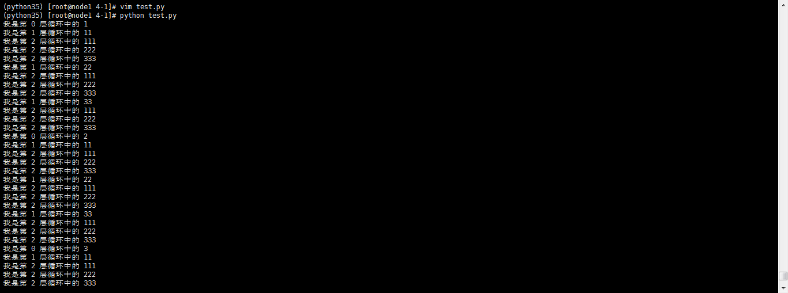

最近在看python网络数据采集这本书，并跟着书中的章节进行练习，在练习第五章，六度空间游戏中，其中递归函数看起来有点蒙
后经过在笔记本上将递归过程罗列下来，才理清头绪，源代码如下

```code
from bs4 import BeautifulSoup
from urllib.request import urlopen
import re
import pymysql
conn=pymysql.connect(host='127.0.0.1', user='root', passwd='zhaimingyu', db='mysql', charset='utf8')
cur = conn.cursor()
cur.execute("USE wikipedia")

def insertPageIfNotExists(url):
 cur.execute("SELECT *FROM pages WHERE url = %s", (url))
 if cur.rowcount == 0:
  cur.execute("INSERT INTO pages (url) VALUES  (%s)", (url))
  conn.commit()
  return cur.lastrowid
 else:
  return cur.fetchone()[0]

def insertLink(fromPageId, toPageId):
 cur.execute("SELECT * FROM link WHERE fromPageId = %s AND toPageId = %s", ((fromPageId,(toPageId))))
 if cur.rowcount == 0:
   cur.execute("INSERT INTO link (fromPageId, toPageId) VALUES (%s, %s)", ((fromPageId, (toPageId))))
   conn.commit()

pages = set()
def getLinks(pageUrl, recursionLevel):
 global pages
 if recursionLevel > 4:
  return ;
 pageId = insertPageIfNotExists(pageUrl)
 html = urlopen("https://en.wikipedia.org"+pageUrl)
 bsObj = BeautifulSoup(html, "html.parser")
 for link in bsObj.findAll("a", href=re.compile("^(/wiki/)((?!:).)*$")):
  insertLink(pageId, insertPageIfNotExists(link.attrs['href']))
  if link.attrs['href'] not in pages:
   newPage = link.attrs['href']
   pages.add(newPage)
   getLinks(newPage, recursionLevel+1)
getLinks("/wiki/Kevin_Bacon", 0)
cur.close()
conn.close()
```


其中比较绕的部分是getLinks中，使用了for循环，在for循环中又调用了getLinks函数，这样实现的递归函数
```code
def getLinks(pageUrl, recursionLevel):
 global pages
 if recursionLevel > 4:
  return ;
 pageId = insertPageIfNotExists(pageUrl)
 html = urlopen("https://en.wikipedia.org"+pageUrl)
 bsObj = BeautifulSoup(html, "html.parser")
 for link in bsObj.findAll("a", href=re.compile("^(/wiki/)((?!:).)*$")):
  insertLink(pageId, insertPageIfNotExists(link.attrs['href']))
  if link.attrs['href'] not in pages:
   newPage = link.attrs['href']
   pages.add(newPage)
   getLinks(newPage, recursionLevel+1)
getLinks("/wiki/Kevin_Bacon", 0)
```
通过下列代码得出的结果可以清晰的反映出程序的执行过程
```code
list0=[1,2,3]
list1=[11,22,33]
list2=[111,222,333]

def test(rec):
  k=rec
  if rec>2:
    return;
  if rec==0:
    rec=list0
  if rec==1:
    rec=list1
  if rec==2:
    rec=list2
  for i in rec:
    print("我是第 %d 层循环中的 %d"%(k,i))
    test(k+1)
test(0)
```
上面函数返回结果如下  
 
拓扑图如下  
 
说明：程序执行过程按照上图1-9过程，之后以此类推
总结，执行函数执行for循环中的首个变量，当递归数超过限定数值，取并列for循环中所有值，返回到上一个父元素取for中所有值，以此类推
