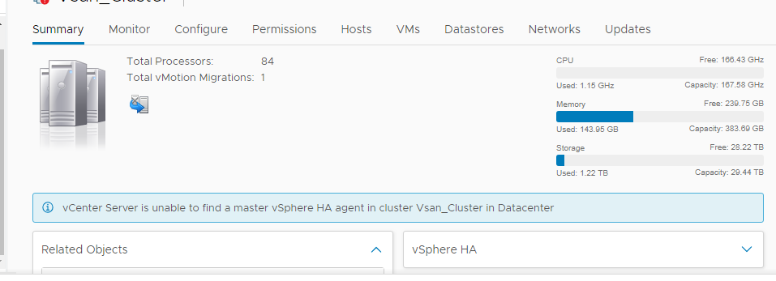
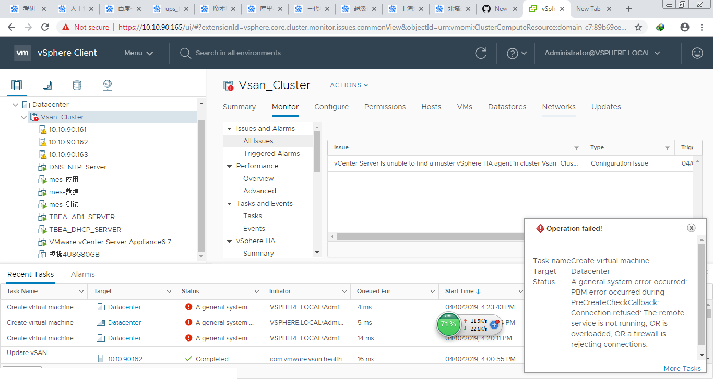

基础环境：vcenter6.7 3台esxi6.7 存储使用vsan    
问题描述      
1.HA功能不可用  

2.创建虚拟机时出现如下错误，应该是vsan问题    

问题处理时长：3天      
问题解决情况：未解决，需要升级解决      
问题处理过程如下：

第一天：      
10:00  打客服电话400-886-8616/8617,然后提供订单编号，然后将问题描述清楚，客服联系工程师，工程师联系我，说可以远程支持调试，需要先在浏览器上安装插件  我的win7x32位用他给的插件不好使，他们也不能用teamviewer，后来找了一个win10的电脑，可以安装上插件      
13:30  工程师开始远程调试，调试过程诸如重启vcenter各个服务，重启HA等操作，问题未解决，说HA不好使的原因可能是vsan问题，他只负责vcenter和HA部分，涉及到的存储部分      
需要另外的工程师解决，需要我这边打包vcenter日志，将日志上传给他，给了我两种上传方式一个web，一个sftp。打包后文件560M左右，在公司用web方式上传中间卡主，有错误代码，跟工程师商议，晚上到家再传日志，明天将分析结果告诉我    
17:00-22：00  上传日志，sftp方式不好使，中间会出现卡死现象，好在web好用，但家里是宽带网(你懂的)，每秒100,200KB上传速度，你就等吧      

第二天：  
9：00  联系昨天的工程师电话，没人接听。打客服电话，报了昨天的工单号，给我分配到了另一个工程师，跟昨天不是一个；我说我昨天晚上上传完日志了，让他下载并帮分析一下，他说他不是技术，会将这个事情告知技术，让他们分析。OK，我等    
10:00  我打电话，问情况怎么样，告知我说他们下不来昨天我上传的日志文件，说他们公司内部网络有问题，给我个qq邮箱，让我上传到那个邮箱中，我将日志打包上传到他指定的邮箱中      
11:00  我打电话告知，我已上传完成，对方告知知晓，并会告知工程师让他尽快分析    
14:00  我打电话询问情况，告诉我工程师忘下载日志了，正在下载(我日你个仙人板板！)，我说我要工程师的电话，告诉我有啥问题直接邮箱联系(我忍~~)，我说那行你今天  
能给我个准确的消息就行，下午16:30之前我要个确切的答案，到底啥原因，能不能分析出来，对方说OK  
16:40我打电话询问情况，给我的答复是通过vcenter日志暂时看不出来是啥问题，而且日志很大500多M，不是一时半会分析完的(当我TM的是小白啊？？？，你TM分析日志不知道找哪个日志么？需要全看么？)  
需要再上传esxi的日志，才能分析原因
17:30我将esxi日志上传到之前给我的qq邮箱中，又告知我之前的qq邮箱是之前那个同事的，今天他休息，让我上传到昨天web和sftp那两种方式的地址上(我当时就炸了，我感觉在耍我，我说这是你们自己的问题，自己去要密码去，我只传这一次，我明早就要结果)  
21:30我收到对方经理级别的人的电话，说他们搞不定，需要vmware的厂家的支持，问我现在能远程连接么(？？？？纳尼，要晚上操作不能提前通知么？这TM人都走光了，我上哪找开门的人，去公司来回3个小时，搞我呢？)  
我说明早再联系吧，然后对方告知我对方的是新加坡的有时差，明早9:30才能开始。

第三天：    
9:30  收到对方的远程连接请求，对方开始操作，一直处理到11:30左右告知我是个vcenter的bug，需要升级(？？纳尼)    

现在的情况是他们可以提供远程支持升级vcenter,但他们只协助，指导操作，然后我上网查了一下vcenter6.7 EP06和U1b发现是今年1月份才发布的，也就是说这个问题是今年1月份才解决的，我这个平台是dell的人上个月来安装的，也就是说他给我安装的时候就是有BUG存在的vcenter6.7版本      

然后我们这边领导找大客户经理看看他那边有没有好的解决方案，让大客户经理和他们dell的人沟通，未完.....  

以下内容将处理过程省略了，写了个结果(NND,累觉不爱)      
第四天：    
升级版本，结果不好使，状态和第一天的一样    

第五天：    
dell一、二线支持查找原因，不好使，上传日志，说明天找新加坡的技术支持    

第六天：    
新加坡的技术支持也没解决，说下周一找vmware的原厂支持   

第四天----第六天就是第一天-----第三天的翻版，一个循环    

第七天：    
上周说是找vmware的原厂支持，今天打电话又告知不是原厂支持，我说那你们别解决了，浪费时间，让领导直接找客户经理去了    

下面是我要吐槽的话：    
通过几天的故障处理不难看出，dell处理故障的流程方面有着一定的问题    
1.内部沟通有问题      
第一天工程师未解决的内容和已经处理的内容和排除过程没有和第二天的工程师及时沟通，导致第二天的工程师远程处理问题的时候将第一天工程师处理过的过程又重复了一遍      
第二天的文件下载过程也能看出来11:00-14:00期间，相当于dell人员没有下载我已经上传的文件(我不知道他们在干嘛...)    
2.不懂得变通    
第一天我下载你的插件不能远程，我有个在市场上比较常见的teamviewer能远程你不用，非得折腾我花费2个小时去解决远程连接的这个问题，我也是醉了    
第二天我上传到QQ邮箱，这个是之前你们给我的上传邮箱，我上传后你告诉我不能用，因为你们员工下班了，是个人邮箱，没有密码，让我重新上传下，确定不是在搞我？    
3.反馈不积极    
基本每次都是我主动打电话去询问情况，即使已经约定了时间，说到时间我需要反馈，也不会主动给我打电话，而且每次我都是多等了10几分钟，仍是没接到电话的情况下，都得我主动打电话，除了最后给我打电话的负责人(估计是怕投诉吧...)    
4.忽悠人    
说是vmware原厂支持，实际不是，是他们自己的人    
总结    
最后问题解决了，没有重装，vsan应该是时间不匹配,vcenter的时间需要通过5480端口查看，HA的原因是vmk1中勾选了managerment选项，并且vmk和vsan网络需要经过三层互通(但是来安装的dell工程师说不需要互通，之前就的项目没做过互通，他对此保留意见...)  
遇到问题，还是自己分析吧，他第三天顶级工程师能做的事情，我之前就弄完了，我以为他能从代码方面分析一下，结果也是查日志找KB库.....      

求人不如求己      

